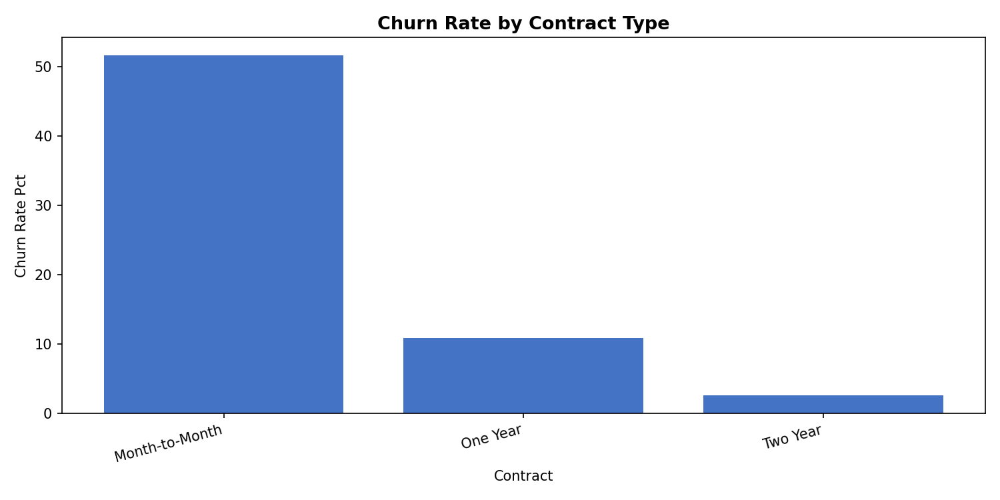
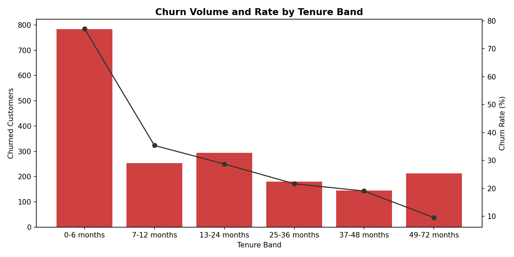

# Customer Retention Intelligence

[](https://customer-retention-intelligence.vercel.app/)
[](https://github.com/LexterMorgan/customer-retention-intelligence)

[](https://www.python.org/)
[](https://pandas.pydata.org/)
[](https://numpy.org/)
[](https://en.wikipedia.org/wiki/SQL)
[](https://www.sqlite.org/)
[](https://react.dev/)
[](https://www.typescriptlang.org/)
[](https://vite.dev/)
[](https://recharts.org/)

An evidence-first customer churn and retention analysis built around one practical question:

> Who is leaving, where is churn concentrated, and which customers or segments should a retention team investigate first?

The project transforms a telecom customer snapshot into validated business findings, descriptive risk segments, business-impact analysis, and an executive-facing dashboard.

## Executive summary

The dataset contains **7,043 customers** from a Q2 2022 California telecom snapshot.

| Metric | Value |
|---|---:|
| Total customers | 7,043 |
| Existing customers analyzed | 6,589 |
| Churned customers | 1,869 |
| Retained customers | 4,720 |
| New customers excluded from retention rates | 454 |
| Churn rate | **28.37%** |
| Retention rate | **71.63%** |

The main finding is that churn is not evenly distributed. It is concentrated among customers with a flexible contract, short tenure, and specific service combinations.

## Where churn concentrates

| Pattern | Finding | Why it matters |
|---|---|---|
| Month-to-Month contracts | **51.7% churn** and **88.6% of all churn** | The largest retention volume sits among customers without long-term commitment |
| 0–6 months tenure | **77.2% churn** and **42.0% of all departures** | Churn is heavily front-loaded in the early customer lifecycle |
| Month-to-Month + 0–6 months + Fiber | **91.2% churn** across 487 customers | The clearest high-risk intersection in the dataset |
| Fiber Optic customers | **42.1% churn rate** | Fiber is associated with higher churn, especially when combined with short tenure and Month-to-Month contracts |
| Competitor-related exits | **45.0% of churned customers** | Devices, offers, speed, and data competition dominate stated exit reasons |
| Two-Year contracts | **2.6% churn** | Long-term contracts are associated with much lower observed churn |





## Business impact

The SQL business-impact analysis estimates:

| Metric | Value |
|---|---:|
| Monthly recurring value associated with churned customers | **$137,086.65** |
| Historical revenue from churned customers | **$3,684,459.82** |
| Monthly recurring value associated with Month-to-Month churn | **$118,802.90** |

These figures describe the analyzed dataset. They are not audited company financials or causal estimates of what a retention program would recover.

## Questions answered

The analysis investigates:

- What is the overall churn and retention rate?
- Which contract types have the highest churn?
- How does churn change across customer tenure?
- Which internet service types show higher churn?
- Which offers are associated with different churn patterns?
- How does churn vary across billing and payment behavior?
- Which customer characteristics are associated with churn?
- Which segments contain the greatest concentration of departures?
- Which customers should a retention team investigate first?
- What is the potential value associated with churned customers?

## Dashboard

The interactive dashboard turns the analysis into a decision-oriented interface with:

- Executive KPIs
- Executive insights
- Contract and tenure breakdowns
- Billing and payment analysis
- Demographic analysis
- Internet-service comparisons
- Churn-reason analysis
- High-risk customer segments
- Descriptive risk tiers
- Customer prioritization
- Interactive global filters

The dashboard is designed to answer:

1. What is happening?
2. Where is the problem concentrated?
3. Which customers or segments deserve attention?
4. What should be investigated next?

## Analysis workflow

```text
Raw customer data
        ↓
Data cleaning and validation
        ↓
Exploratory analysis
        ↓
SQL business analysis
        ↓
Risk segmentation
        ↓
Dashboard payload
        ↓
Executive dashboard
```

### Data preparation

The cleaning workflow:

- Preserves raw files separately from processed data
- Standardizes fields and data types
- Handles missing values using documented rules
- Creates tenure, age, charge, churn, and add-on fields
- Flags negative monthly charges without silently removing them
- Validates customer and ZIP-code relationships
- Produces a reproducible processed dataset

### SQL analysis

The SQL layer covers:

- Core KPI reconciliation
- Churn by contract
- Churn by tenure
- Churn by internet service
- Churn by offer
- Churn by demographics
- Churn by billing and payment method
- Churn reasons
- High-risk segment analysis
- Descriptive risk tiers
- Business-impact scenarios

See [`sql/README.md`](sql/README.md) for the query sequence and metric definitions.

## Churn definition

Retention rates use existing customers only:

```text
Existing customers = Churned + Stayed

Churn rate = Churned / (Churned + Stayed)

Retention rate = Stayed / (Churned + Stayed)
```

`Joined` customers remain in the dataset but are excluded from churn-rate denominators because they were new acquisitions during the observation period.

Full definition: [`docs/churn_definition.md`](docs/churn_definition.md)

## Analytical guardrails

This project is descriptive and diagnostic, not predictive.

- Risk tiers are rule-based, not machine-learning predictions.
- Segment findings show associations, not proven causes.
- Customers can appear in multiple overlapping segments.
- Churn reasons are self-reported and describe stated reasons, not verified causes.
- Offer E is strongly confounded by contract type, tenure, and internet service.
- Negative monthly charges are flagged and preserved rather than silently corrected.
- Small-city rates require sample-size awareness.
- The dataset is a Q2 2022 snapshot and does not provide a time-series churn trend.
- Hypothetical value scenarios are illustrations, not forecasts or causal estimates.

See [`docs/dataset_audit.md`](docs/dataset_audit.md) and [`analysis/sql_business_findings.md`](analysis/sql_business_findings.md).

## Repository structure

```text
analysis/
├── data_cleaning.py
├── exploratory_analysis.py
├── dashboard_payload.py
├── business_insights.md
├── sql_business_findings.md
└── outputs/

data/
├── raw/
└── processed/

docs/
├── churn_definition.md
└── dataset_audit.md

frontend/
├── src/
├── package.json
└── vite.config.ts

sql/
├── 01_kpi_overview.sql
├── 02_churn_by_contract.sql
├── 03_churn_by_tenure.sql
├── 04_churn_by_internet.sql
├── 05_churn_by_offer.sql
├── 06_churn_by_demographics.sql
├── 07_churn_by_billing.sql
├── 08_churn_reasons.sql
├── 09_high_risk_segments.sql
├── 10_customer_risk_ranking.sql
├── 11_business_impact.sql
└── README.md

tests/
├── test_dashboard_payload.py
└── test_data_cleaning.py
```

## Run the dashboard locally

```bash
cd frontend
npm install
npm run dev
```

Open [http://localhost:5173](http://localhost:5173).

Run frontend validation:

```bash
npm run lint
npm run build
```

## Reproduce the analysis

Install the Python dependencies used by the analysis scripts, then run:

```bash
python analysis/data_cleaning.py
python analysis/exploratory_analysis.py
python analysis/dashboard_payload.py
```

Run the automated tests:

```bash
pytest
```

Run a SQL query:

```bash
sqlite3 sql/customer_churn.db < sql/01_kpi_overview.sql
```

## Project purpose

This project demonstrates how to move from customer-level records to practical retention intelligence:

- Start with a clean and auditable dataset
- Define business metrics precisely
- Validate findings through both Python and SQL
- Look beyond the overall churn percentage
- Find concentrated customer-risk patterns
- Connect analysis to business questions
- Present evidence in an executive-friendly dashboard

Built as a portfolio and educational project by [Michael Alexander](https://github.com/LexterMorgan).
